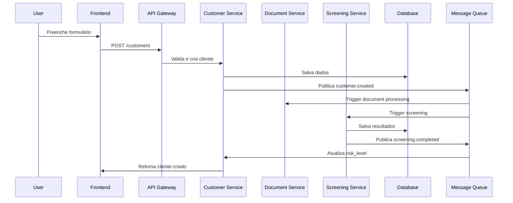
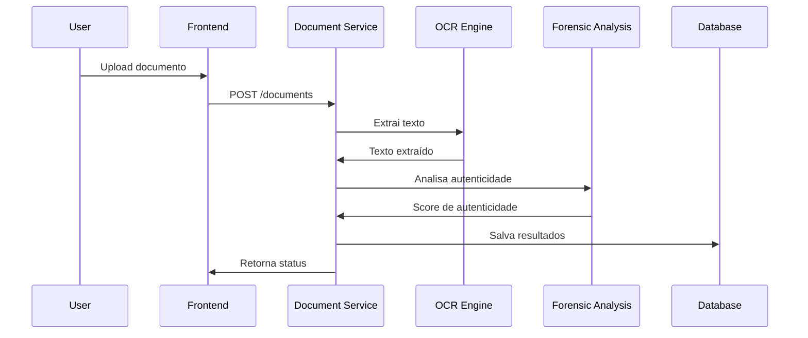

# Arquitetura do Sistema CERES

## 📖 Índice

- [Visão Geral](#visão-geral)
- [Arquitetura de Alto Nível](#arquitetura-de-alto-nível)
- [Componentes](#componentes)
- [Fluxo de Dados](#fluxo-de-dados)
- [Segurança](#segurança)
- [Escalabilidade](#escalabilidade)
- [Monitoramento](#monitoramento)

## 🎯 Visão Geral

O CERES é construído com uma arquitetura moderna de microserviços, projetada para alta disponibilidade, escalabilidade e conformidade regulatória.

### Princípios Arquiteturais

- **Microserviços**: Componentes independentes e especializados
- **API-First**: Todas as funcionalidades expostas via APIs REST
- **Event-Driven**: Comunicação assíncrona entre serviços
- **Cloud-Native**: Pronto para deployment em nuvem
- **Security by Design**: Segurança integrada em todas as camadas

## 🏗️ Arquitetura de Alto Nível

```
┌─────────────────┐    ┌─────────────────┐    ┌─────────────────┐
│   Web Browser   │    │   Mobile App    │    │   Third-party   │
│                 │    │                 │    │      APIs       │
└─────────┬───────┘    └─────────┬───────┘    └─────────┬───────┘
          │                      │                      │
          └──────────────────────┼──────────────────────┘
                                 │
                    ┌─────────────┴─────────────┐
                    │      Load Balancer        │
                    │        (Nginx)            │
                    └─────────────┬─────────────┘
                                  │
                    ┌─────────────┴─────────────┐
                    │      API Gateway          │
                    │        (Kong)             │
                    └─────────────┬─────────────┘
                                  │
        ┌─────────────────────────┼─────────────────────────┐
        │                         │                         │
┌───────┴────────┐    ┌───────────┴──────────┐    ┌────────┴────────┐
│   Frontend     │    │      Backend         │    │   External      │
│   (React)      │    │     Services         │    │   Services      │
│                │    │    (Django/DRF)      │    │                 │
└────────────────┘    └──────────┬───────────┘    └─────────────────┘
                                 │
                    ┌────────────┴────────────┐
                    │     Message Queue       │
                    │       (Kafka)           │
                    └────────────┬────────────┘
                                 │
                    ┌────────────┴────────────┐
                    │      Database           │
                    │    (PostgreSQL)         │
                    └─────────────────────────┘
```

## 🔧 Componentes

### Frontend Layer

#### React Application
- **Framework**: React 18+ com Vite
- **State Management**: Context API + Hooks
- **Styling**: Tailwind CSS
- **Routing**: React Router v6
- **HTTP Client**: Axios
- **Authentication**: JWT tokens

**Responsabilidades:**
- Interface do usuário
- Validação de formulários
- Gerenciamento de estado local
- Comunicação com APIs

### API Gateway

#### Kong Gateway
- **Rate Limiting**: Controle de taxa por usuário/IP
- **Authentication**: Validação de JWT
- **Load Balancing**: Distribuição de carga
- **Logging**: Logs centralizados
- **Monitoring**: Métricas de performance

**Configuração:**
```yaml
services:
  - name: ceres-backend
    url: http://backend:8000
    routes:
      - name: api-route
        paths: ["/api"]
        methods: ["GET", "POST", "PUT", "DELETE"]
```

### Backend Services

#### Customer Enrollment Service
- **Responsabilidade**: Gestão de clientes
- **Endpoints**: CRUD de clientes, validações
- **Integrações**: Document Processing, Screening

#### Document Processing Service
- **Responsabilidade**: OCR e análise de documentos
- **Tecnologias**: Tesseract, PyPDF2, PIL
- **Funcionalidades**: 
  - Extração de texto
  - Análise forense
  - Validação de autenticidade

#### Sanctions Screening Service
- **Responsabilidade**: Verificação contra listas restritivas
- **Fontes**: 20+ APIs de dados abertos
- **Algoritmos**: Fuzzy matching, scoring
- **Performance**: Cache Redis, processamento assíncrono

#### Risk Assessment Service
- **Responsabilidade**: Cálculo de scores de risco
- **Algoritmos**: Machine Learning, regras de negócio
- **Inputs**: Dados do cliente, histórico, screening

#### Report Generation Service
- **Responsabilidade**: Geração de relatórios
- **Formatos**: PDF, Excel, CSV
- **Templates**: Jinja2, WeasyPrint
- **Agendamento**: Celery Beat

### Data Layer

#### PostgreSQL Database
```sql
-- Estrutura principal
Customers (id, personal_data, contact_info, risk_level)
Documents (id, customer_id, file_path, extracted_data)
Screenings (id, customer_id, results, risk_score)
Reports (id, type, parameters, file_path)
Audit_Logs (id, user_id, action, timestamp, details)
```

#### Redis Cache
- **Session Storage**: Dados de sessão JWT
- **API Cache**: Respostas de APIs externas
- **Rate Limiting**: Contadores de requisições
- **Task Queue**: Filas Celery

### Message Queue

#### Apache Kafka
- **Topics**:
  - `customer.events`: Eventos de clientes
  - `document.events`: Eventos de documentos
  - `screening.events`: Eventos de screening
  - `audit.events`: Eventos de auditoria

### External Integrations

#### Data Sources
- **OFAC**: API REST, atualização diária
- **UN**: XML feed, parsing automático
- **EU**: JSON API, webhook notifications
- **OpenSanctions**: GraphQL API

## 🔄 Fluxo de Dados

### Cadastro de Cliente



### Processamento de Documento



## 🛡️ Segurança

### Autenticação e Autorização

#### JWT (JSON Web Tokens)
```json
{
  "header": {
    "alg": "HS256",
    "typ": "JWT"
  },
  "payload": {
    "user_id": "uuid",
    "username": "admin",
    "roles": ["compliance_officer"],
    "permissions": ["read:customers", "write:reports"],
    "exp": 1640995200,
    "iat": 1640991600
  }
}
```

#### RBAC (Role-Based Access Control)
- **Admin**: Acesso total
- **Compliance Officer**: Screening, relatórios
- **Analyst**: Visualização, análise
- **Auditor**: Apenas leitura

### Criptografia

#### Dados em Trânsito
- **TLS 1.3**: Todas as comunicações
- **Certificate Pinning**: Apps móveis
- **HSTS**: Headers de segurança

#### Dados em Repouso
- **AES-256**: Dados sensíveis
- **Database Encryption**: PostgreSQL TDE
- **File Encryption**: Documentos uploadados

### Auditoria

#### Logs de Auditoria
```json
{
  "timestamp": "2025-06-14T10:30:00Z",
  "user_id": "uuid",
  "action": "customer.create",
  "resource_id": "customer-uuid",
  "ip_address": "192.168.1.100",
  "user_agent": "Mozilla/5.0...",
  "details": {
    "fields_changed": ["email", "phone"],
    "old_values": {...},
    "new_values": {...}
  },
  "hash": "sha256:..."
}
```

## 📈 Escalabilidade

### Horizontal Scaling

#### Microserviços
- **Stateless**: Serviços sem estado
- **Load Balancing**: Nginx/HAProxy
- **Auto Scaling**: Kubernetes HPA
- **Circuit Breaker**: Hystrix pattern

#### Database Scaling
- **Read Replicas**: PostgreSQL streaming
- **Partitioning**: Por data/região
- **Connection Pooling**: PgBouncer
- **Query Optimization**: Índices, EXPLAIN

### Vertical Scaling

#### Resource Optimization
- **CPU**: Processamento assíncrono
- **Memory**: Cache inteligente
- **Storage**: Compressão, archiving
- **Network**: CDN, compression

### Caching Strategy

#### Multi-Layer Cache
```
Browser Cache (1h) → CDN (24h) → Redis (1w) → Database
```

#### Cache Patterns
- **Cache-Aside**: Dados de clientes
- **Write-Through**: Configurações
- **Write-Behind**: Logs de auditoria

## 📊 Monitoramento

### Métricas de Sistema

#### Application Metrics
- **Response Time**: P50, P95, P99
- **Throughput**: Requests/second
- **Error Rate**: 4xx, 5xx errors
- **Availability**: Uptime percentage

#### Business Metrics
- **Customers Processed**: Por hora/dia
- **Screening Success Rate**: %
- **Document Processing Time**: Média
- **False Positive Rate**: %

### Observabilidade

#### Logging
- **Structured Logs**: JSON format
- **Centralized**: ELK Stack
- **Correlation IDs**: Request tracing
- **Log Levels**: DEBUG, INFO, WARN, ERROR

#### Monitoring Stack
- **Prometheus**: Métricas
- **Grafana**: Dashboards
- **Jaeger**: Distributed tracing
- **AlertManager**: Alertas

#### Health Checks
```python
# Django health check
def health_check(request):
    checks = {
        'database': check_database(),
        'redis': check_redis(),
        'external_apis': check_external_apis(),
        'disk_space': check_disk_space()
    }
    
    status = 'healthy' if all(checks.values()) else 'unhealthy'
    
    return JsonResponse({
        'status': status,
        'checks': checks,
        'timestamp': timezone.now().isoformat()
    })
```

### Alerting

#### Alert Rules
- **High Error Rate**: > 5% em 5 minutos
- **High Response Time**: > 2s P95 em 10 minutos
- **Database Connections**: > 80% do pool
- **Disk Space**: < 10% disponível

#### Notification Channels
- **Email**: Para alertas críticos
- **Slack**: Para alertas de warning
- **PagerDuty**: Para alertas de produção
- **SMS**: Para alertas críticos fora do horário

---

**© 2025 CERES. Sistema de Compliance e Avaliação de Risco.**

